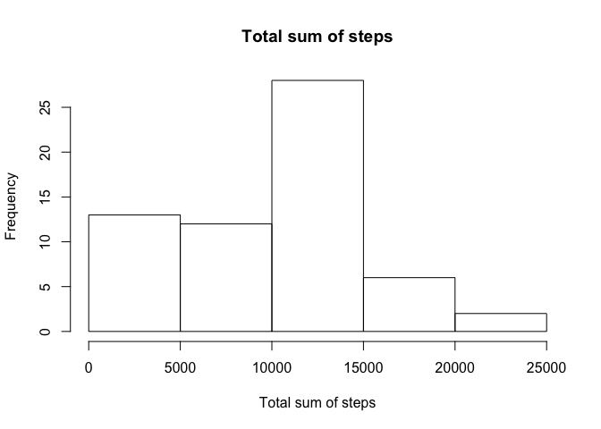
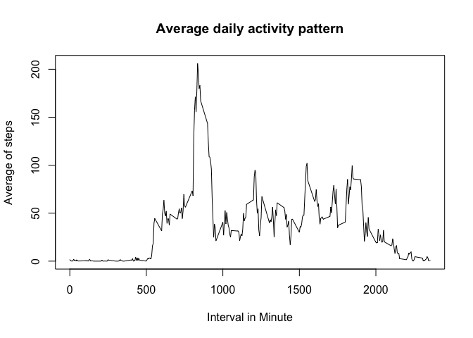
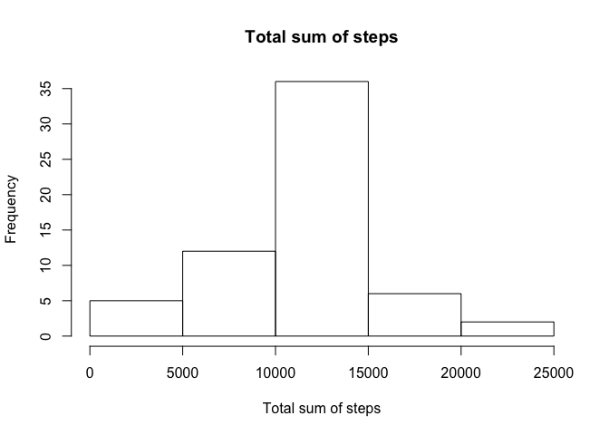
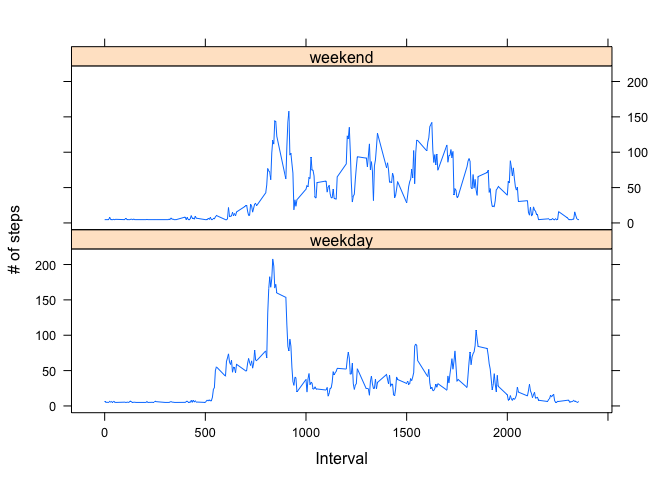

# Reproducible Research: Peer Assessment 1

## Loading and preprocessing the data

```r
# Load lattice library
library(lattice)
# Load data from "activity.csv"
actData<-read.csv("activity.csv", stringsAsFactors=FALSE)
```


## What is mean total number of steps taken per day?

```r
# Aggregate steps data according to date (mean)
stepDataSum<-aggregate(actData$steps, list(date=actData$date), sum, na.rm=TRUE)
names(stepDataSum)<-c("date","total")
# Generate histgram
hist(stepDataSum$total, 
     main="Total sum of steps", 
     xlab="Total sum of steps")
```

 

```r
# Report mean
mean(stepDataSum$total)
```

```
## [1] 9354.23
```

```r
# Report median
median(stepDataSum$total)
```

```
## [1] 10395
```


## What is the average daily activity pattern?

```r
intervalDataMean<-aggregate(actData$steps, list(interval=actData$interval), mean, na.rm=TRUE)
names(intervalDataMean)<-c("interval","meanOfStep")
plot(intervalDataMean$interval, 
    intervalDataMean$meanOfStep, 
    type = "l",
    main = "Average daily activity pattern",
    xlab = "Interval in Minute",
    ylab = "Average of steps")
```

 

From above figure, we can see there is the maximum # of step during 800 ~ 900 interval.

## Imputing missing values

Here we use mean to replace NA values.


```r
# Get # of NA in steps
naCount<-sum(is.na(actData$steps))
# Get indies of NA
naIdx<-which(is.na(actData$steps))
# Generate a vector that using mean as a filled value 
meanVec <- rep(mean(actData$steps, na.rm=TRUE), times=length(naIdx))
# Replace NA with mean 
actData[naIdx, "steps"] <- meanVec
# Aggregate steps data according to date (mean)
stepDataSum<-aggregate(actData$steps, list(date=actData$date), sum, na.rm=TRUE)
names(stepDataSum)<-c("date","total")
# Generate histgram
hist(stepDataSum$total, 
     main="Total sum of steps", 
     xlab="Total sum of steps")
```

 

```r
# Report mean
mean(stepDataSum$total)
```

```
## [1] 10766.19
```

```r
# Report median
median(stepDataSum$total)
```

```
## [1] 10766.19
```

After filling NA values with mean, the mean and median are increased since the valid dataset becomes larger.

## Are there differences in activity patterns between weekdays and weekends?

```r
# Transfer orginal data$date to POSIX date format
actData$date <- as.POSIXct(actData$date, format="%Y-%m-%d")
# Add a new attrbute into data frame. Use weekdays() to transfer date to week
actData<-cbind(actData, datetype = ifelse(weekdays(actData$date)=="Sunday" | weekdays(actData$date)=="Saturday","weekend","weekday"))
# Aggregate the mean of steps, averaged across all daytype variables
meanData <- aggregate(actData$steps, list(datetype=actData$datetype, interval = actData$interval), mean)
names(meanData) <- c("datetype", "interval", "mean")
xyplot(mean ~ interval | datetype, meanData, type="l", lwd=1, xlab="Interval", ylab="# of steps", layout=c(1,2))
```

 
